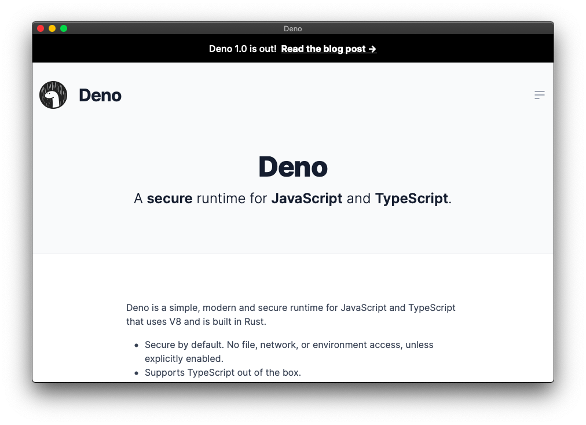

<h1 align="center">🕸 Web Window</h1>
<p align="center">Open a website as a standalone window with Deno


<p align="center">
  
  
  
</p>

<p align="center"><p>

This app uses [deno_webview](https://github.com/eliassjogreen/deno_webview) and [denomander](https://github.com/siokas/denomander).

## 🚀 Features
- [x] Open a website (and specify title, resizable, and fullscreen)
- [ ] Set toolbar color
- [ ] Install "executable", so website can be opened as an app without using command-line

## 🌏 Options
To open a website as a window, run 

```
deno run -A --unstable https://raw.githubusercontent.com/ninest/web-window/master/index.ts open https://github.com/ninest
```

There are a few more options:

- `--fullscreen`: Open the window in fullscreen
- `--title <string>`: Set the window's title, to show in the toolbar
- `--resizable <bool>`: Whether the window should be resizable (defaults to true)

`-f`, `-t <string>`, and `-r <bool>` can also be used.

### Examples
```
# Open my github profile in a window with a title "Ninest"
deno run -A --unstable https://raw.githubusercontent.com/ninest/web-window/master/index.ts open https://github.com/ninest --title "Ninest" 

# Open youtube in fullscreen with no title
deno run -A --unstable https://raw.githubusercontent.com/ninest/web-window/master/index.ts open http://youtube.com/ --fullscreen
```
(no need to download anything to run these examples)

To see a list of all options/commands, run 
```
deno run -A --unstable https://raw.githubusercontent.com/ninest/web-window/master/index.ts --help
```

## 🛠 Build setup
Clone or fork the repository, then run 
```
deno run -A --unstable index.ts open https://github.com/ninest
```

## 😱 Issues and limitations
- Non-resiable windows cannot be put into fullscreen
- `WebView.setColor` doesn't seem to work on Mac OS. When this is fixed, `--color` can be added