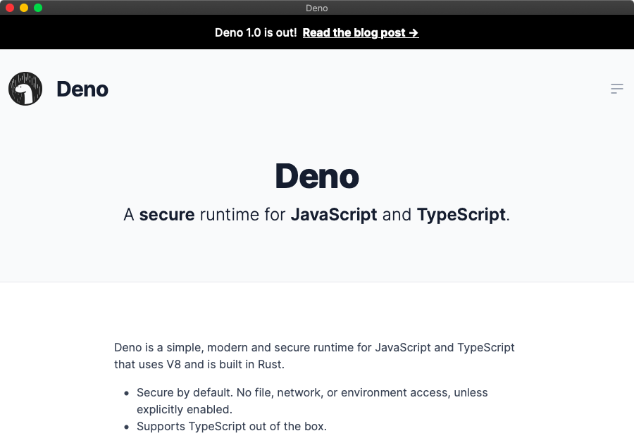

# Web Window
> Open a website as a standalone window with Deno


[](http://makeapullrequest.com)




## 🌏 Options
To open a website as a window, run 

```
deno run -A --unstable https://raw.githubusercontent.com/ninest/web-window/master/index.ts open https://github.com/ninest
```

There are a few more options:

- `--fullscreen`: Open the window in fullscreen
- `--title <string>`: Set the window's title, to show in the toolbar
- `--resizable <bool>`: Whether the window should be resizable (defaults to true)


### Examples
```
# Open my github profile in a window with a title "Ninest"
deno run -A --unstable https://raw.githubusercontent.com/ninest/web-window/master/index.ts open https://github.com/ninest --title "Ninest" 

# Open youtube in fullscreen with no title
deno run -A --unstable https://raw.githubusercontent.com/ninest/web-window/master/index.ts open http://youtube.com/ --fullscreen
```
(no need to download anything to run these examples)

## 🛠 Build setup
Clone or fork the repository, then run 
```
deno run -A --unstable index.ts open https://github.com/ninest
```

## 😱 Issues and limitations
- Non-resiable windows cannot be put into fullscreen